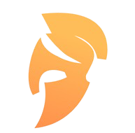

#  Vocab Wars 

<div style="text-align: center;">
  
</div>

Welcome to Vocab Wars, the Wordle Contest Platform! This platform allows users to create and participate in Wordle contests. It is built using [Next.js](https://nextjs.org) and is designed to be responsive and user-friendly.

## 🌟 Inspirations 🌟

The idea for Vocab Wars is inspired by both the popular [Wordle](https://www.nytimes.com/games/wordle/index.html) game and the competitive programming platform [Codeforces](https://codeforces.com). It combines the fun of word puzzles with the competitive spirit of coding contests.

## 🚀 Features 🚀

- **Create Contests**: Users can create their own Wordle contests with custom words and settings.
- **Join Contests**: Users can join public contests or use invitation links to join private contests.
- **Leaderboard**: Track your progress and see how you rank against other players.

## 🛠️ Getting Started 🛠️

First, clone the repository:

```bash
git clone https://github.com/million-t/Vocab-Wars-Frontend.git
```

Install the dependencies:

```bash
npm install
# or
yarn install
# or
pnpm install
# or
bun install
```

Run the development server:

```bash
npm run dev
# or
yarn dev
# or
pnpm dev
# or
bun dev
```

Open [http://localhost:3000](http://localhost:3000) with your browser to see the result.
